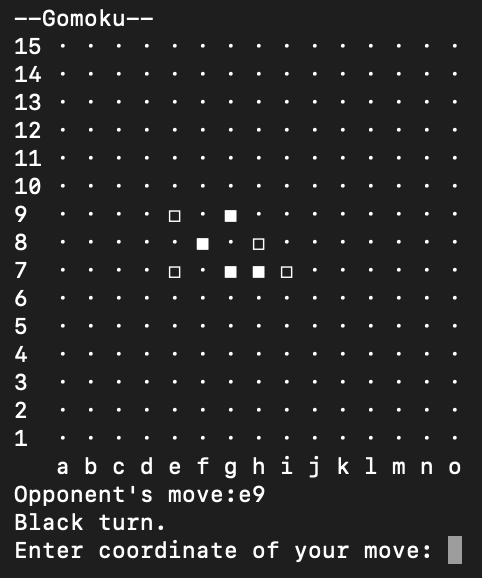

# Gomoku

> A terminal-based Gomoku game with a configurable Minimax AI.

This is a Python implementation of the classic Gomoku (Five in a Row) game. It supports both human vs human and human vs AI modes with configurable AI search depth.

The AI combines Minimax with alpha-beta pruning, pattern-based evaluation, candidate-move filtering, and transposition-table caching.



## Features

- 15×15 terminal board
- Human vs Human and Human vs AI gameplay
- Configurable AI search depth
- Automatic win condition detection

## Requirements

- Python 3.12 or later

## How to Run

1. Clone the repository:

   ```bash
   git clone https://github.com/Leon-coder-prog/Gomoku.git
   ```

2. Change into the project directory:

   ```bash
   cd Gomoku
   ```

3. Run the game:

   ```bash
   python main.py
   ```

   If not working:

   ```bash
   python3 main.py
   ```

## Gameplay Instructions

When the program starts you will see a menu:

- Enter **a** or **b** to play **Human vs Human** or **Human vs AI**

If you choose to play with AI, you will need to:

- Choose an AI depth (1 to 3 is recommended).

  **_Depths greater than 3 require confirmation and significantly increase CPU usage and running time._**
- Choose your side (Black or White)

During the game, enter moves in the format:

```text
a3
```

- The letter represents the column (a to o)
- The number represents the row (1 to 15)

## Win Rules

A player wins when they get 5 of their pieces in a row in any direction: horizontal, vertical, or diagonal.

## Project Structure

```text
.
├── main.py         # Main program
├── board.py        # Board display logic
├── ai.py           # AI logic
├── assets/         # Project images and assets
└── README.md       # This file
```

## License

This project is licensed under the MIT License. See the [LICENSE](LICENSE) file for details.
